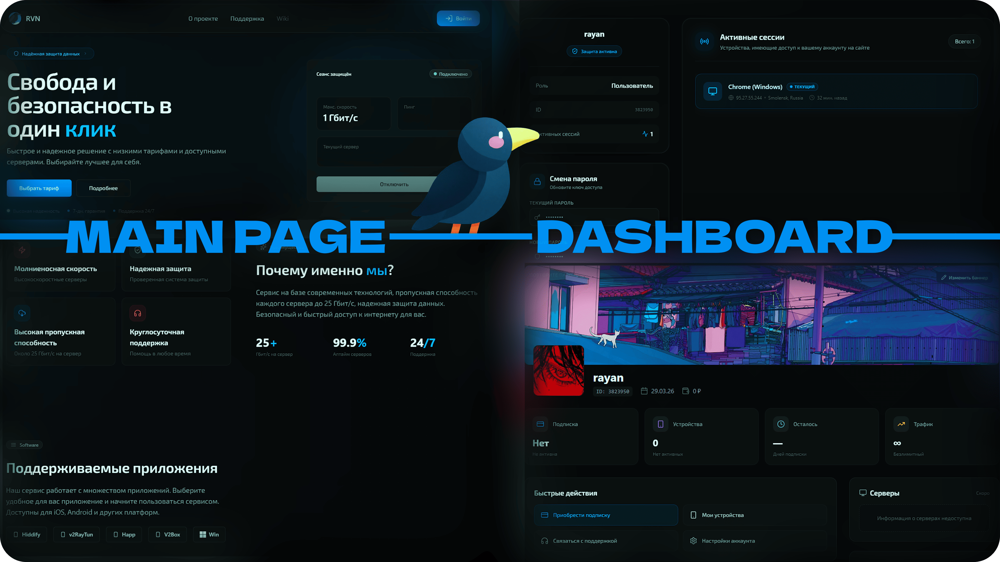

<h1 align="center">
  
  rvncom/website
</h1>

  

  
  
  
  
  
  
  
  

> **🔒 Private Repository** — The source code for this service is not publicly available. This repository contains only documentation, environment examples, and public assets. No external contributions or access to the source code.

---

## 🚀 Tech Stack

**Core** — Next.js 16, React 19, TypeScript, Tailwind CSS, Radix UI

**API** — tRPC 11, Socket.io

**Data** — Drizzle ORM (PostgreSQL), Redis, AWS S3

**Auth** — Argon2id, OAuth (Google, GitHub, Yandex, Telegram, VK, Twitch)

**Infra** — Docker, Rust → WASM (image processing), Turbopack

## 📚 Documentation

### Authentication

| Document | Description |
|----------|-------------|
| [Authentication architecture](docs/auth/architecture.en.md) | Sessions, device tokens, OAuth, password hashing, cookies |
| [OAuth providers](docs/auth/oauth.en.md) | Google / Yandex / Twitch / VK / Telegram / GitHub-admin flows, CSRF state, popup vs full-page, account linking |
| [Sessions & Cookies](docs/auth/sessions.en.md) | `token` / `session_id` / `user_data` cookies, token binding, refresh flow, logout, session store |
| [Device fingerprinting](docs/auth/device-fingerprint.en.md) | Two-layer FPID system, IndexedDB, server-side hashing, deduplication |
| [Device IP geolocation](docs/auth/geolocation.en.md) | MaxMind GeoLite2, ip-api.com fallback, caching, storage format |

### Notifications

| Document | Description |
|----------|-------------|
| [Notification system](docs/notifications/notifications.en.md) | Real-time notifications, UPSERT grouping, WebSocket delivery, caching |
| [Notification types](docs/notifications/types.en.md) | Type catalog, UPSERT semantics, cleanup policy, read paths, system broadcasts |

### WebSocket

| Document | Description |
|----------|-------------|
| [WebSocket architecture](docs/websocket/architecture.en.md) | Connection, rooms, broadcast, authentication |
| [Event Directory](docs/websocket/events.en.md) | Client/server events, error codes, REST endpoints |
| [Reconnection & resilience](docs/websocket/reconnection.en.md) | Socket.IO retry strategy, debounce, token rotation, room rejoin, broadcast model |

### Security

| Document | Description |
|----------|-------------|
| [Bot Protection](docs/security/protection.en.md) | Proxy middleware, suspicion detector, rate limiting, CSRF, security headers |
| [Security Headers & CSP](docs/security/headers.en.md) | CSP directives, HSTS, CORS, static-file handling, origin validation |
| [Role-Based Access Control](docs/security/rbac.en.md) | `user` / `support` / `admin` roles, tRPC middleware, `pex` cookie flag, cache invalidation |

### Storage & Media

| Document | Description |
|----------|-------------|
| [Storage & Media](docs/storage/storage.en.md) | S3-compatible upload, Redis media cache (gzip + TTL), WASM (Rust) Image Processor |
| [Upload pipeline](docs/storage/upload.en.md) | Magic-byte validation, per-route specifics (avatar/banner/support), thumbhash, cache warm-up |

### Subscriptions & Payments

| Document | Description |
|----------|-------------|
| [Subscriptions & Payments](docs/subscriptions/subscriptions.en.md) | Plan catalogue, Remnawave provisioning, balance/promo/external purchase flows, payment webhook |
| [Balance & Promo](docs/subscriptions/balance.en.md) | `users.balance`, `payments`, `balance_transactions` ledger, test promo, top-up & purchase flows |

### Database

| Document | Description |
|----------|-------------|
| [Migrations](docs/database/migrations.en.md) | Drizzle Kit workflow, custom migrations for triggers/CHECK constraints, `db:generate` / `db:migrate` scripts, bootstrap on existing DBs |

## 🌐 Environment

`.env.example`:

- `NEXT_PUBLIC_DOMAIN` — app URL
- `DATABASE_URL` — PostgreSQL connection
- `REDIS_URL` — cache
- `S3_*` — object storage
- `CSRF_SECRET` / `TURNSTILE_*` — security
- OAuth keys per provider

---
